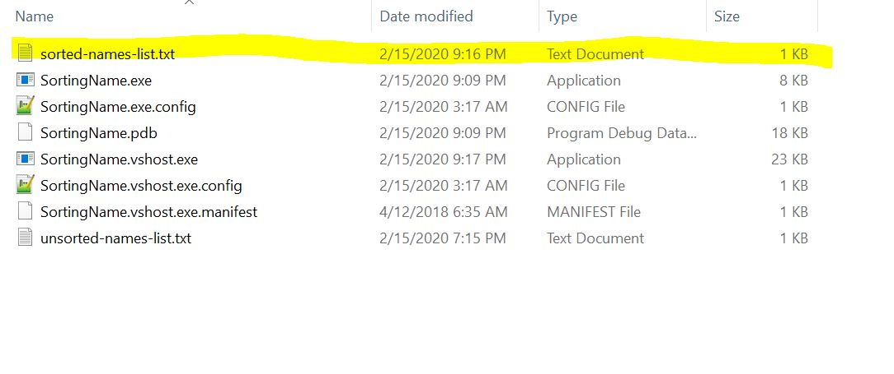

# SortingNameApplication
Description : Sorting Name if same folder with application and with input parameter file name

Practical Documentation
Installation & Implementation :

1. Clone Project to Any folder in your computer
2. Add File unsorted-names-list.txt into folder  : \SortingName\SortingName\bin\Debug

3. Open With Visual Studio then set NameSorter Project as Startup Project

4. Right Click on NameSorter Project And click Properties,
   Add Parameter unsorted-names-list.txt into Argument

5. Build and start Program, it will bring output on command prompt and write/overwrite a file named sorted-names-list.txt in folder \SortingName\SortingName\bin\Debug

6. Add File unsorted-names-list.txt into folder  : \SortingName\UnitTestNameSorter\bin\Debug

7. On Visual Studio click test>Windows>Test Explorer
8. On Test Explorer Window click Run All to exec all method in unit test, the result will be a report, and write/overwrite a file named sorted-names-list.txt in folder \SortingName\UnitTestNameSorter\bin\Debug

9. Open Folder \SortingName\SortingName\bin\Debug then copy to files SortingName.exe and sorted-names-list.txt to any folder in your computer

10. Run Application On Cmd and it will make output on console and write write/overwrite a file named sorted-names-list.txt in this current folder

